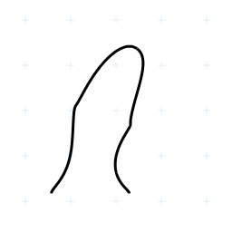
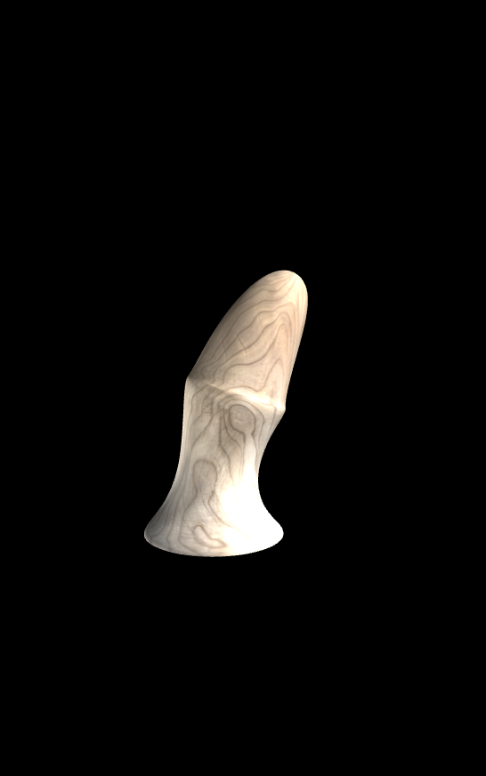
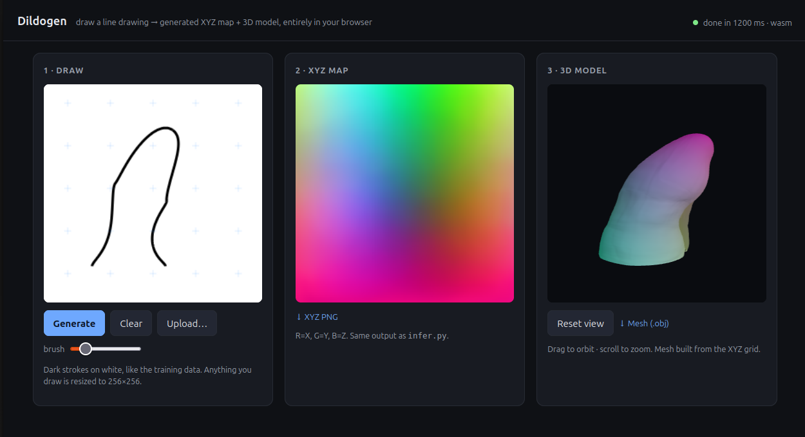
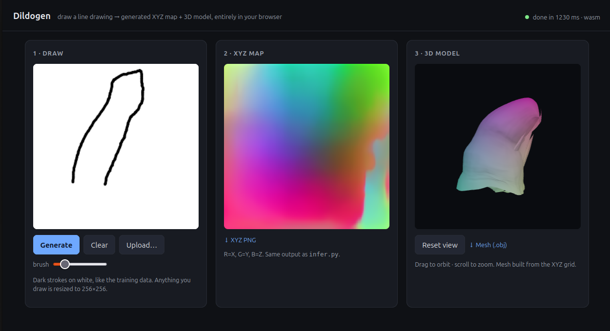

# First run: install everything
```bash
> python3 -m venv .venv
> source .venv/bin/activate
> python3 -m pip install -r requirements.txt
```

# Train my model
```bash
> source .venv/bin/activate
> python3 train.py  --data_root ./node-store-server/uploads/2026/03/ --epochs 200 --batch_size 16
```

# Resume trainiing
```bash
> python train.py --data_root ./node-store-server/uploads/2026/03/ --resume checkpoints/last.pt
```

# To leave the python virtual environment
```bash
> deactivate
```

# Folder structure
```
dildogen-transformer/
├── classes/dataset.py
├── node-store-server/
│   ├── src/…
│   ├── uploads/
│   │   └── 2026/03/
│   │            ├── preview2d/…    # These are the 2D line drawings
│   │            ├── preview3d/…    # These are just 3d screeshots for convenience
│   │            └── sculptmap/…    # These are the RGB coded XYZ data files
│   └── views/…
…  …
├── README.md
…  …
```

## The training data

2D Drawing


Corresponding sculptmap with xyz coordinates:


A screenshot of the _expected_ 3D model:



## Resize training images to fit required pixel size (256 x 256)
```bash
cd node-store-server/
./image-resize-to-256x256.sh uploads/2026/03/sculptmaps
./image-resize-to-256x256.sh uploads/2026/03/preview2d
```


## Update for training data
```bash
Python -u train.py --data_root ./node-store-server/uploads/2026/03 --epochs 200 --batch_size 16 --num_workers 4 --checkpoint_dir ./checkpoints

# Check status:
tail -f checkpoints/train.log
```


## Optimize setup to reduce epoch training time
```
cd ./dildogen-transformer
source .venv/bin/activate 2>/dev/null || true
echo "=== param count at base_features=32 ==="
python -c "from model import UNet; print(f'{UNet(1,3,base_features=32,depth=4).count_parameters():,} params')"
echo "=== launching ==="
nohup python -u train.py \
  --data_root ./node-store-server/uploads/2026/03 \
  --epochs 200 \
  --batch_size 16 \
  --num_workers 4 \
  --base_features 32 \
  --checkpoint_dir ./checkpoints \
  > ./checkpoints/train.log 2>&1 &
echo "started PID $!"
```

### Output for `tail checkpoints/train.log`
```
 tail -f checkpoints/train.log
    [train] batch  103/346 loss=0.7423 (0.50 it/s, ETA   484s)
    [train] batch  120/346 loss=0.7285 (0.51 it/s, ETA   447s)
    [train] batch  137/346 loss=0.7405 (0.51 it/s, ETA   411s)
    [train] batch  154/346 loss=0.6969 (0.51 it/s, ETA   379s)
    [train] batch  171/346 loss=0.6843 (0.51 it/s, ETA   346s)
    [train] batch  188/346 loss=0.6259 (0.51 it/s, ETA   311s)
    [train] batch  205/346 loss=0.6370 (0.51 it/s, ETA   277s)
    [train] batch  222/346 loss=0.6582 (0.51 it/s, ETA   243s)
    [train] batch  239/346 loss=0.6385 (0.51 it/s, ETA   210s)
    [train] batch  256/346 loss=0.6397 (0.51 it/s, ETA   176s)
    [train] batch  273/346 loss=0.6316 (0.51 it/s, ETA   143s)

    New best model saved (val_loss=0.2939)
    [train] batch    1/346 loss=0.4703 (0.07 it/s, ETA  5248s)
    [train] batch   18/346 loss=0.3811 (0.38 it/s, ETA   855s)
    [train] batch   35/346 loss=0.3995 (0.43 it/s, ETA   728s)
    [train] batch   52/346 loss=0.4154 (0.46 it/s, ETA   643s)
    [train] batch   69/346 loss=0.3901 (0.47 it/s, ETA   586s)
    [train] batch   86/346 loss=0.4281 (0.48 it/s, ETA   540s)
    [train] batch  103/346 loss=0.4084 (0.49 it/s, ETA   496s)
    [train] batch  120/346 loss=0.3708 (0.49 it/s, ETA   457s)
    [train] batch  137/346 loss=0.4004 (0.49 it/s, ETA   430s)
    [train] batch  154/346 loss=0.3808 (0.49 it/s, ETA   393s)
    [train] batch  171/346 loss=0.4018 (0.49 it/s, ETA   357s)
    [train] batch  188/346 loss=0.3301 (0.49 it/s, ETA   322s)
    [train] batch  205/346 loss=0.4237 (0.49 it/s, ETA   286s)
    [train] batch  222/346 loss=0.4229 (0.49 it/s, ETA   251s)
    [train] batch  239/346 loss=0.3698 (0.50 it/s, ETA   216s)
    [train] batch  256/346 loss=0.3467 (0.50 it/s, ETA   181s)
    [train] batch  273/346 loss=0.3607 (0.50 it/s, ETA   146s)
    [train] batch  290/346 loss=0.3701 (0.50 it/s, ETA   112s)
    [train] batch  307/346 loss=0.3512 (0.50 it/s, ETA    78s)
    [train] batch  324/346 loss=0.3644 (0.50 it/s, ETA    44s)
    [train] batch  341/346 loss=0.3358 (0.50 it/s, ETA    10s)
    [train] batch  346/346 loss=0.3343 (0.50 it/s, ETA     0s)
    [val] batch    1/44 loss=0.2290 (0.10 it/s, ETA   450s)
    [val] batch    3/44 loss=0.2283 (0.25 it/s, ETA   163s)
    [val] batch    5/44 loss=0.2246 (0.37 it/s, ETA   105s)
    [val] batch    7/44 loss=0.2304 (0.47 it/s, ETA    79s)
    [val] batch    9/44 loss=0.2183 (0.55 it/s, ETA    64s)
    [val] batch   11/44 loss=0.2256 (0.61 it/s, ETA    54s)
    [val] batch   13/44 loss=0.2181 (0.67 it/s, ETA    46s)
    [val] batch   15/44 loss=0.2279 (0.72 it/s, ETA    40s)
    [val] batch   17/44 loss=0.2345 (0.76 it/s, ETA    35s)
    [val] batch   19/44 loss=0.2328 (0.80 it/s, ETA    31s)
    [val] batch   21/44 loss=0.2526 (0.83 it/s, ETA    28s)
    [val] batch   23/44 loss=0.2086 (0.86 it/s, ETA    24s)
    [val] batch   25/44 loss=0.2342 (0.88 it/s, ETA    21s)
    [val] batch   27/44 loss=0.2325 (0.91 it/s, ETA    19s)
    [val] batch   29/44 loss=0.2336 (0.93 it/s, ETA    16s)
    [val] batch   31/44 loss=0.2173 (0.95 it/s, ETA    14s)
    [val] batch   33/44 loss=0.2306 (0.97 it/s, ETA    11s)
    [val] batch   35/44 loss=0.2534 (0.98 it/s, ETA     9s)
    [val] batch   37/44 loss=0.2450 (1.00 it/s, ETA     7s)
    [val] batch   39/44 loss=0.2357 (1.01 it/s, ETA     5s)
    [val] batch   41/44 loss=0.2185 (1.02 it/s, ETA     3s)
    [val] batch   43/44 loss=0.2302 (1.04 it/s, ETA     1s)
    [val] batch   44/44 loss=0.2051 (1.06 it/s, ETA     0s)
Epoch [005/200] train=0.3881 val=0.2329 lr=1.20e-04 time=768.9s
  MAE=0.1007 RMSE=0.1345 δ1.25=0.612 NormErr=44.21°
  ✓ New best model saved (val_loss=0.2329)
    [train] batch    1/346 loss=0.4145 (0.07 it/s, ETA  5008s)
    [train] batch   18/346 loss=0.3416 (0.38 it/s, ETA   860s)
    [train] batch   35/346 loss=0.3701 (0.42 it/s, ETA   741s)
    [train] batch   52/346 loss=0.3585 (0.44 it/s, ETA   667s)
    [train] batch   69/346 loss=0.3462 (0.45 it/s, ETA   611s)
    [train] batch   86/346 loss=0.3507 (0.45 it/s, ETA   572s)
```


## Resume
cd ./dildogen-transformer
source .venv/bin/activate 2>/dev/null || true
# preserve the old log rather than overwrite it
[ -f checkpoints/train.log ] && cp checkpoints/train.log checkpoints/train.log.through_epoch45
nohup python -u train.py \
  --data_root ./node-store-server/uploads/2026/03 \
  --epochs 200 \
  --batch_size 16 \
  --num_workers 4 \
  --base_features 32 \
  --depth 4 \
  --image_size 256 \
  --checkpoint_dir ./checkpoints \
  --resume checkpoints/last.pt \
  > ./checkpoints/train.log 2>&1 &
echo "started PID $!"

started PID 16251


## Converting the weights (model) to an ONNX web compatible model

```bash
python3 export_onnx.py --checkpoint checkpoints/best.pt --output web/model/dildogen.onnx

```
## Reduce the web model's file size by 50% by using fp16 format (16 bit floating point)

```bash
python3 export_onnx.py --checkpoint checkpoints/best.pt --output web/model/dildogen.onnx --fp16
```


## Start web server

```bash
cd web/
python3 -m http.server 8000
```

Call the URL `http://127.0.0.1:8000` in your browser.








